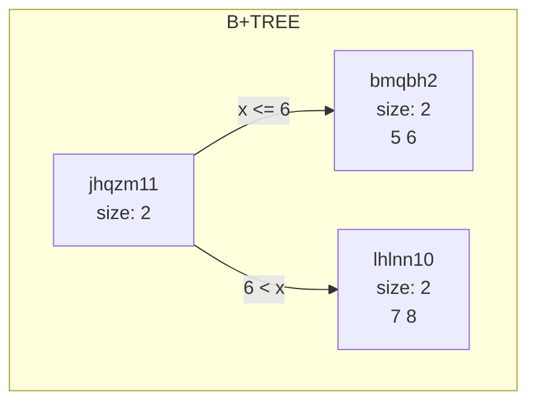
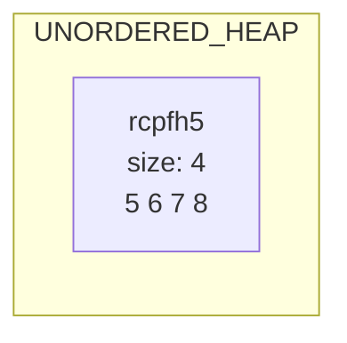

```mermaid
graph TD
subgraph B+TREE
jhqzm11[jhqzm11<br/>size: 2<br/>]
bmqbh2[bmqbh2<br/>size: 2<br/>5 6 ]
jhqzm11-->|x <= 6|bmqbh2
lhlnn10[lhlnn10<br/>size: 2<br/>7 8 ]
jhqzm11-->|6 < x|lhlnn10
end
```

```mermaid
graph LR
subgraph UNORDERED_HEAP
rcpfh5[rcpfh5<br/>size: 4<br/>5 6 7 8 ]
end
```
